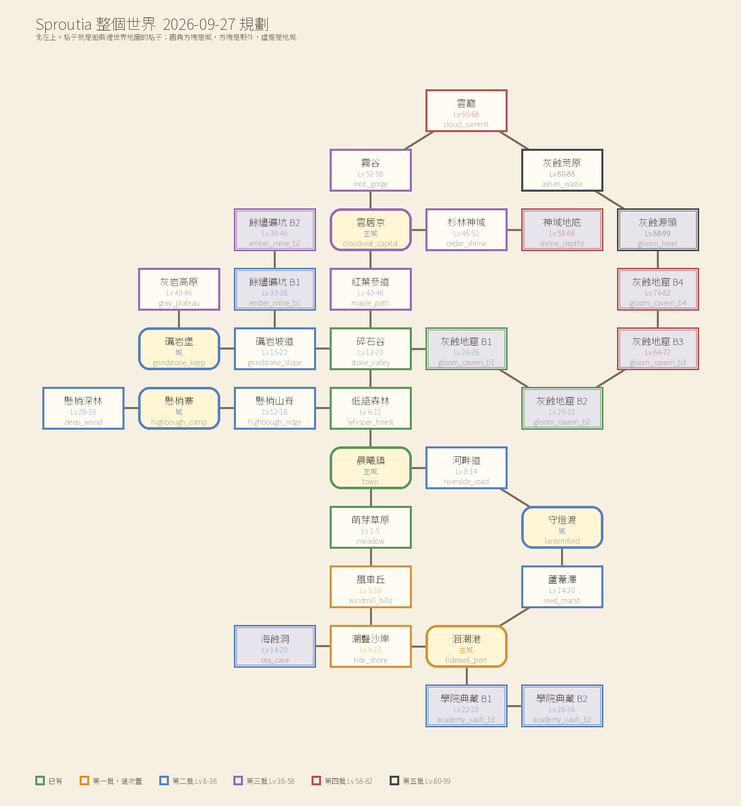

# Realm of Faded 世界地圖與怪物

地圖在 `data/maps/*.json`，怪物在 `data/monsters.json`，全部由伺服器驗證，客戶端只負責畫。
世界觀照 `docs/奪色世界規劃書.md`；`docs/世界觀.md` 是退回的草稿，不用它的設定。
資料裡現在有晨曦鎮和三間室內、萌芽草原、低語森林、碎石谷、灰蝕地窟 B1 和 B2、風車丘、潮聲沙岸、洄潮港、劍侍考場；
怪物只有萌芽草原那四隻，其他圖的 `spawns` 是空的。這份其餘的怪物和王都是規劃，數字做進資料時照 `docs/自有數值系統.md` 的曲線算。

## 1. 守住的規矩

- 不設等級門檻。2026-09-16 使用者要原版 RO 那樣「什麼都不教、什麼都不限制」，地圖檔和傳送點都沒有 `require_level`，1 級也走得進地窟。等級帶只給設計者排怪用
- NPC 不推任務，轉職只在玩家自己開口問導師時才講
- 基本等級上限 99、兩輪制，2026-09-19 定案，見 `docs/轉生與等級.md`
- 王最低 30 級，`balance.json` 的 `boss_rules.min_level`；新手區的王是放在新手區的高等怪，照 RO 的天使波利
- 打怪不掉金幣，錢只有賣戰利品一條路，掉落的期望賣價對 `loot_value` 曲線
- 名字全部原創，怪物代號英文小寫加底線；職業清單一律讀 `data/jobs.json`
- 世界地圖視窗只有地圖名字、區域名字、你在哪、去過哪。不寫建議等級、不寫怎麼過去、不列地圖檔的 `hint`、不列隱藏區域；去過哪裡只認伺服器送的 `visited`

## 2. 整個世界

世界是一幅畫，灰蝕從灰蝕地窟深處往外吃，越深越灰、王越強，終點是灰蝕地窟最底下的灰蝕源頭。
源頭有兩條路進去：從灰蝕地窟一路往下，或從雲巔走灰蝕荒原繞過去。

示意圖由 `docs/圖/world_plan.py` 畫，格子就是世界地圖視窗排的格子，北在上。

連法照 RO 普隆德拉一帶的傳送點，出處是 rAthena `npc/warps/cities/prontera.txt` 和 `npc/re/warps/fields/*.txt`：
主城幾道門各接一張野外；地城入口開在野外或城裡；野外會繞成圈，晨曦鎮、萌芽草原、風車丘、潮聲沙岸、洄潮港、蘆葦澤、守燈渡、河畔道繞一圈回到晨曦鎮；
越後面的城離晨曦鎮越遠，洄潮港隔三張野外，雲居京四張以上。同一段等級至少有兩條路可以選。

大小和密度照 rAthena `npc/re/mobs/fields/` 五區 54 張野外，一張大多放 210 到 290 隻。萌芽草原照 prt_fild08 縮成 96×96 公尺放 49 隻，一隻約 140 平方公尺。
新的野外一律 96×96 公尺、走得到約 7000 平方公尺、放 45 到 55 隻；地城一格 3 公尺、約 72×60 公尺、放 25 到 35 隻；主城 60 到 70 公尺見方，一轉城 45 到 55 公尺見方。

### 2.1 地圖總表

屬性主調是這張圖大多數怪的屬性，排怪和排王照這欄。批次 0 是已有，1 是蓋好還沒接上，2 到 5 是之後照順序蓋。

| 代號 | 名字 | 類型 | 等級帶 | 地形 | 屬性主調 | RO 對照 | 批次 |
|---|---|---|---|---|---|---|---|
| town | 晨曦鎮 | 主城 | 安全區 | 平原城鎮 | 無 | 普隆德拉 | 0 |
| meadow | 萌芽草原 | 野外 | 1～5 | 起伏草原、水窪 | 水、土 | prt_fild08 | 0 |
| whisper_forest | 低語森林 | 野外 | 6～12 | 密林、泥路 | 土、暗 | prt_fild01 | 0 |
| stone_valley | 碎石谷 | 野外 | 13～20 | 乾河床、三面山壁 | 土、風 | 妙勒尼山路 | 0 |
| gloom_cavern_b1 | 灰蝕地窟 B1 | 地城 | 20～26 | 岩洞 | 暗 | 普隆德拉下水道 | 0 |
| gloom_cavern_b2 | 灰蝕地窟 B2 | 地城 | 26～32 | 岩洞、Boss 房 | 暗 | 下水道 B3、B4 | 0 |
| windmill_hills | 風車丘 | 野外 | 5～10 | 麥田、風車、樹籬 | 風、火 | prt_fild07、09 | 1 |
| tide_shore | 潮聲沙岸 | 野外 | 9～15 | 沙丘、退潮灘、礁岩，南邊是海 | 水、風 | 依斯魯得海岸 | 1 |
| tidewell_port | 洄潮港 | 主城 | 安全區 | 運河、石橋、學院、港口 | 無 | 吉芬加依斯魯得 | 1 |
| sea_cave | 海蝕洞 | 地城 | 14～20 | 退潮才走得進去的岩洞 | 水、暗 | iz_dun | 2 |
| academy_vault_b1 | 學院典藏 B1 | 地城 | 22～28 | 淹了一半的書庫 | 水、光 | gef_dun00 | 2 |
| academy_vault_b2 | 學院典藏 B2 | 地城 | 28～36 | 禁書庫、封印室 | 時間、空間 | gef_dun01、02 | 2 |
| reed_marsh | 蘆葦澤 | 野外 | 14～20 | 沼澤、蘆葦、木棧道 | 水、土 | 無 | 2 |
| lanternford | 守燈渡 | 城 | 安全區 | 渡口、有頂的長橋 | 無 | 普隆德拉教會 | 2 |
| riverside_road | 河畔道 | 野外 | 8～14 | 柳堤、田埂 | 水、光 | prt_fild06 | 2 |
| highbough_ridge | 懸梢山脊 | 野外 | 12～18 | 起霧的山脊林 | 風、土 | pay_fild08 | 2 |
| highbough_camp | 懸梢寨 | 城 | 安全區 | 巨樹上的平台和繩橋 | 無 | 斐揚 | 2 |
| deep_wood | 懸梢深林 | 野外 | 28～36 | 巨樹、藤、濃霧 | 風、暗 | pay_fild 深處 | 2 |
| grindstone_slope | 礪岩坡道 | 野外 | 15～22 | 石階坡道、斷崖、礦車軌道 | 土、火 | mjolnir_02 | 2 |
| grindstone_keep | 礪岩堡 | 城 | 安全區 | 三層台地的要塞 | 無 | 依斯魯得劍士公會 | 2 |
| ember_mine_b1 | 餘燼礦坑 B1 | 地城 | 30～38 | 礦道、軌道、熔爐 | 火、土 | mjo_dun01 | 2 |
| ember_mine_b2 | 餘燼礦坑 B2 | 地城 | 38～46 | 熔岩礦脈、Boss 房 | 火 | mjo_dun02、03 | 3 |
| grey_plateau | 灰岩高原 | 野外 | 40～46 | 裸岩、火山灰 | 火、風 | gef_fild 高地 | 3 |
| maple_path | 紅葉參道 | 野外 | 40～46 | 石階、鳥居、紅葉林 | 土、風 | 天津參道 | 3 |
| cloudseat_capital | 雲居京 | 主城 | 安全區 | 日本風山城、五重塔 | 無 | 天津加斐揚 | 3 |
| cedar_shrine | 杉林神域 | 野外 | 46～52 | 巨杉林、石燈籠 | 光、暗 | ama_fild01 | 3 |
| mist_gorge | 霧谷 | 野外 | 52～58 | 峽谷、瀑布、寒泉 | 水、風 | 無 | 3 |
| shrine_depths | 神域地底 | 地城 | 58～66 | 神社底下的古洞 | 時間、空間 | ama_dun | 4 |
| cloud_summit | 雲巔 | 野外 | 60～68 | 裸岩峰頂、雷雲、積雪 | 風、土 | 妙勒尼山頂 | 4 |
| gloom_cavern_b3 | 灰蝕地窟 B3 | 地城 | 64～72 | 燒過的岩層 | 暗、火 | 無 | 4 |
| gloom_cavern_b4 | 灰蝕地窟 B4 | 地城 | 74～82 | 被扭歪的洞 | 暗、空間 | 無 | 4 |
| ashen_waste | 灰蝕荒原 | 野外 | 80～88 | 整張被吃成線稿 | 暗、土 | 尼夫海姆 | 5 |
| gloom_heart | 灰蝕源頭 | 地城 | 88～99 | 灰蝕的源頭 | 暗、時間、空間 | 無 | 5 |

時間和空間最早在學院典藏 B2 出現，方術士和陰陽師二轉前後拿得到剛好。

### 2.2 城鎮

| 城 | 位置 | 誰在這裡 | 傳送 |
|---|---|---|---|
| 晨曦鎮 | 世界中央 | 艾拉存檔、希爾傳送、道具店、鐵匠、倉庫、四位一轉導師 | 希爾：去過的地方都能送 |
| 洄潮港 | 南岸 | 第二座主城；之後術士導師搬來，學院出巫師和大賢者 | 傳送員，規則同希爾 |
| 守燈渡 | 晨曦鎮東南 | 之後信徒導師搬來，出神職者和神諭官 | 渡船只到洄潮港和晨曦鎮 |
| 懸梢寨 | 低語森林西邊山脊 | 之後斥候導師搬來，出獵人和神射手 | 引路人只到晨曦鎮 |
| 礪岩堡 | 碎石谷西邊斷崖 | 之後劍侍導師搬來，出聖劍士和勇者 | 車隊只到晨曦鎮 |
| 雲居京 | 碎石谷北邊山裡 | 第三座主城，日本風那一支的二轉三轉 | 傳送員，規則同希爾 |

一轉的四座城都離它的野外只有一兩張圖，初心者練到職業 10 級附近就走得到，和 RO 的一轉公會都在前期城鎮一樣。

### 2.3 第一批三張，還沒接上

風車丘、潮聲沙岸、洄潮港已經蓋好，怪物和 NPC 還沒放。出生區照地圖檔的 `zones` 放，王在小路盡頭：風車丘是老磨坊，潮聲沙岸是燈標沙嘴。
萌芽草原往南的出口還沒開，所以三張寫 `world_map: false`。世界地圖視窗排得下之後再接：草原開南出口、風車丘開北邊傳送點和小路第一段、三張拿掉 `world_map: false`、伺服器的預設地圖清單加這三張。
海蝕洞洞口、學院典藏入口、洄潮港東北城門第二批才開。

### 2.4 音樂

現有三首：登入、晨曦鎮、萌芽草原。還缺的曲子和用在哪：

- 森林：低語森林、懸梢山脊、懸梢深林
- 山谷：碎石谷、礪岩坡道、灰岩高原
- 地城：所有地城
- 南岸野外：風車丘、潮聲沙岸、蘆葦澤、河畔道
- 港城：洄潮港
- 小城：守燈渡、懸梢寨、礪岩堡
- 和風：雲居京、紅葉參道、杉林神域、霧谷、雲巔
- 終盤：灰蝕荒原、灰蝕源頭、大王戰

## 3. 地圖的規則

### 3.1 傳送

- 每個傳送點都有回程。伺服器啟動時檢查目的地存在、可以走、不落在對面的傳送點裡
- 從出生點和每個傳送落點都要走得到每個傳送點、存檔點、NPC；擺設把通道擠到不到 0.5 公尺寬時讓開擺設，不改尋路
- 傳送員只列親自去過而且現在能去的地圖，去過的記在角色的 `visited_maps`。伺服器驗證地圖存在、允許傳送、去過、不是現在這張、落點可以走，地圖 tick 結束才搬人，不看等級
- 晨曦鎮不用去過也能回去，像 RO 的回城；落點是地圖檔的 `save_point`，沒寫用 `player_spawn`
- 地城第二層以下寫 `warp_allowed: false`，要自己走下去，回城卷軸是唯一的快速撤退
- 目前不收錢，之後照 RO 卡普拉依距離收 600 到 1200 金幣

### 3.2 每張野外和地城

- 四到六個區域 `zones`，其中一個 `hidden` 隱藏區域不送客戶端，要玩家自己走到；一隻巡邏守衛；一隻王
- 一般怪三到四種、精英一隻、王一隻；王刻意比地圖等級高很多，一般怪才是練等的主力
- 每一個等級帶同時要有主線任務、一般怪、精英或王、隱藏區域，不會只能站著刷同一群怪
- 看得到的就是走得到的：`ground.outside` 寫 `dark` 時走不到的地面收成黑的，草、花、擺設只長在走得到的地方，邊上的樹和石頭根部貼著可走範圍的邊
- 小路 `paths` 每一段都要走得到，直直撞進走不到的地方那一頭一定是傳送點；傳送點周圍 5 公尺內邊上不擺東西
- 一群怪用 `count`、`center`、`radius` 撒點，種子分到每一隻 `地圖 id#群組#序號`，每次開伺服器位置一樣，改了擋路只有被擋到的那幾隻換位置
- 撒點避開不可行走區、傳送點、小路 3.5 公尺內，路上經過的人才不會被整群主動怪一次拉住；圓心本來就壓在路上的群組放寬
- 地城用 `layout` 格子畫，`#` 岩壁、`.` 地板、`P` 柱子，一格 3 公尺，不可行走區由同一份配置算

萌芽草原就是 RO 的南門：入口附近沒有怪，越往南越難，一次多一種怪的脾氣，依序是被動的萊姆、會叫同伴的小樹苗、會撞人的水晶兔，小路盡頭是埋伏的木樁王。

### 3.3 擺設的擋路

地圖檔只寫 `props`，擋不擋路由 `data/props.json` 的 footprint 算，伺服器和客戶端讀同一份，形狀一定一致。手寫的 `blockers` 只留給崖邊、看不見的邊界、地城岩壁、連成一線的城牆。

- 地面以上高過 0.25 公尺的一律擋路。世界對移動來說是平的，比腳踝高就是身體插進模型裡。
  2026-09-17 使用者回報「我還是直接穿透」「走到一些台階我他媽直接穿進去」，就是照 RO 慣例把燈柱、長椅、台階寫成不擋的那一批
- 真的要走得過去的寫 `walk_through: true` 加 `note` 說明兩側誰在擋，目前只有地窟洞口和岩拱；樓梯擋路，傳送點擺在樓梯腳下；新模型一定要在表裡表態
- 人造物量模型外框，不能比模型大；樹、石頭這些自然物只擋樹幹和底座
- 形狀只用方形和矩形不用圓：方形邊長 `2 × radius × 0.8862`，和同半徑的圓同面積，不跟著轉。伺服器一 tick 一步、客戶端一幀一步，沿圓邊滑動會分岔超過預測修正門檻，玩家擦過樹幹會被拉一下
- 中間留通道的擺設用 `parts` 拆塊，例如城門樓只擋門墩和塔
- 出生點、存檔點、傳送點各留 0.8 公尺，NPC 和怪物群中心留 0.25 公尺；擺設壓到就丟掉那一塊並發警告，地圖照樣載入

## 4. 怪物

一種怪一顆色魄，每多一種怪就多一套美術，所以怪物分家族共用骨架和動作，換顏色、比例和頭上的東西：
泡泡、嫩芽、小獸、蟲、鳥、殼、骸、靈火、器物，王各自一張新圖。換色的做法照 `docs/怪物行為.md` 第 5 節的 `base` 繼承。
60 級以內規劃 21 張有怪的圖：一般怪 90 種、精英 21、王 25。外觀要鮮豔，怪物身上的顏色是從世界偷來的，打倒牠顏色回到世界。

數值方向：一般怪照 `docs/自有數值系統.md` 的怪物曲線乘個性倍率；精英和地區王的倍率見 `docs/怪物行為.md` 第 5 節；大王血量約同等級曲線 30 倍、經驗 20 倍。
重生：一般怪 8 到 20 秒、精英 60 到 90 秒、地區王 60 分鐘、大王 120 到 180 分鐘。

### 4.1 每張圖的怪

萌芽草原的數值和位置在 `data/monsters.json` 和 `data/maps/meadow.json`，其他是規劃。

| 地圖 | 一般怪 | 精英 | 王 |
|---|---|---|---|
| 萌芽草原 | 萊姆 1、小樹苗 2、水晶兔 3 | 無 | 木樁王 30 |
| 風車丘 | 麥稈蚱 5、稻草鴉 6、乾草滾滾 7、燎尾狐 8、風車精 9 | 老稻草人 10 | 焦穗公 32 |
| 潮聲沙岸 | 鉗沙蟹 9、海風鷗 11、鹽泡 12、刺海膽 14 | 老鉗蟹 15 | 潮鳴巨鰻 33 |
| 低語森林 | 蕨葉蟲 6、微光孢菇 8、枯枝樹精 10、灰蝕狼 12 | 灰蝕頭狼 13 | 空心老樹 33 |
| 河畔道 | 河蜆 8、燈芽 9、螢光蜻 10、柳條精 11、河獺 13 | 大河獺 14 | 河燈靈 31 |
| 懸梢山脊 | 霧松鼠 12、苔背龜 14、松針蛛 15、霧鴞 17 | 老霧鴞 18 | 霧翼鷹母 34 |
| 碎石谷 | 岩殼蝸 14、碎石鼠 16、峽谷禿鷲 18、燧石蜥 19 | 碎石巨鼠 19 | 碎石霸主 35 |
| 蘆葦澤 | 泥蛙 14、蘆芽 15、蘆葦螳 16、沼蛭 18、澤鬼火 19 | 澤底老蛙 20 | 泥淖巨鯰 36 |
| 海蝕洞 | 洞壁蟹 14、墨水章 16、洞窟蝠 17、溺骸 18 | 老溺骸 20 | 潮時螺 36 |
| 礪岩坡道 | 岩羊 16、熔渣蟲 17、礦車怪 19、斷崖鷹 21 | 老岩羊 22 | 斷層巨蜥 36 |
| 灰蝕地窟 B1 | 灰泡 21、灰蝕骷髏 22、腐朽行屍 24、礦工骸 25 | 灰蝕骨長 26 | 蝠巢母 38 |
| 灰蝕地窟 B2 | 骨弓手 27、影犬 28、灰蝕巫骸 29、空殼騎士 30 | 灰蝕巫長 31 | 骨陣官 38、大王灰蝕骸冠 42 |
| 學院典藏 B1 | 濕書蠹 22、墨漬泡 23、燭火靈 25、守書甲 27 | 潮影 28 | 潮痕館長 36 |
| 學院典藏 B2 | 沙時蟲 29、翻頁靈 31、時鐘精 33、封印甲 34 | 封印長 35 | 大王禁書 42 |
| 懸梢深林 | 風貂 29、影蛾 31、深林蛛 32、苔角鹿 34 | 深林蛛母 35 | 燈角古鹿 42 |
| 餘燼礦坑 B1 | 餘燼礦工骸 31、熔渣爬蟲 32、礦石小人 34、爐火靈 36 | 礦坑監工 37 | 礦脈母岩 44 |
| 餘燼礦坑 B2 | 熔岩泡 39、火蠑螈 41、熔骸 43、爐鬼 44 | 熔岩巨漢 45 | 大王爐心 50 |
| 灰岩高原 | 灰息鴉 40、燼野豬 42、石膚蜥 44、雷雲精 45 | 燼牙老豬 46 | 灼風鵬 52 |
| 紅葉參道 | 楓芽 40、山猿 42、石燈籠怪 43、落葉狸 45 | 猿頭目 46 | 石狛 52 |
| 杉林神域 | 白面狐 47、紙符使 49、夜遊魂 50、杉木靈 51 | 老白狐 52 | 杉靈翁 56、燈滅僧 56 |
| 霧谷 | 瀑魚 52、霜蛾 54、崖壁猿 56、泉靈 57 | 白鬃猿 58 | 寒泉主 60、瀑龍 60 |
| 神域地底 | 沙漏蟲 58、裂隙蟲 59、無面守衛 60、碎響 60 | 無面守長 60 | 大王時裂守 60 |

逐隻的屬性、行為、掉落、外觀、王的招式數字寫在 git 歷史裡 `docs/世界地圖與怪物.md` 2026-09-27 的版本，做進資料時從那裡拿。

60 級以上的五張圖只定了家族方向，怪物表還沒寫：雲巔是雷鳥、冰晶、岩精；灰蝕地窟 B3 是燒過的骸和灰火精；B4 是扭歪的器物和裂隙生物；
灰蝕荒原是整隻線稿只有一個部位有顏色的怪；灰蝕源頭是灰蝕本體的分身，最後的大王分階段換四種屬性。
兩輪制下第一輪 89 到 99 級是純練等，第二輪 99 級之後還要打兩千多隻，全部落在灰蝕荒原和灰蝕源頭，這兩張要比其他圖更多種怪、更多王輪著打。

### 4.2 掉落

每一隻一般怪同一個骨架，精英和王往上加：

| 格 | 一般怪 | 精英 | 王 |
|---|---|---|---|
| 主材料 | 40% 到 55% | 必掉 3 個 | 必掉 5 到 8 個 |
| 次材料 | 10% 到 25% | 50% | 必掉 |
| 顏料，顏色照怪的屬性 | 30% | 必掉 2 個 | 必掉 3 到 5 個 |
| 藥水或食物 | 3% 到 12% | 20% | 必掉 |
| 裝備 | 0.1% 到 0.5% | 3% | 王專屬裝備 10% 到 15% |
| 精煉材料，20 級以上 | 1% 到 5% | 15% | 必掉 |
| 色魄 | 千分之一到三 | 1% | 8%，大王 10% |
| 色種 | 無 | 無 | 20%，第一次參與打倒直接給 |
| 王的信物 | 無 | 無 | 必掉 1 個 |

- 一般怪的期望賣價偏離 `loot_value` 曲線不超過三成；顏料、色魄、色種、王的信物賣價壓低或不能賣，不算進曲線
- 稀有度 `tier` 只影響顏色，機率只看 `chance`：主材料 common、次材料 uncommon、精煉材料 rare，色魄、色種、王的信物 epic
- 全部掉在地上，傷害最高的一方有擁有權，一般怪 3 秒、王 10 秒
- 顏料一個屬性一種顏色：火紅、水藍、風黃、土綠、光橙、暗紫、時間金、空間銀；無屬性的怪不掉。現在資料只有綠和藍
- 色魄插的部位看長相就猜得到：有牙爪刺的插武器、有殼甲的插盾或盔甲、有翅膀尾巴的插披風、腳快會跳的插鞋子、頭上有東西會詠唱的插頭飾、發光的小東西插飾品。一顆約等於一條同等級詞綴的七成到一條
- 材料只有怪物掉落、商店、別的配方三條路，2026-09-17 採集整套拿掉。材料要在穿得上那件裝備、用得到那個配方的等級帶就拿得到，不能只掉在更深的地圖
- 每樣材料至少有一個用途，製作、精煉、轉職或食物；舊資料的材料名和 id 能沿用就沿用

## 5. 王

### 5.1 招式規格

2026-09-27 使用者：「王放技能要可以看到方向以及範圍，跟詠唱條，我想做成有點需要操作的遊戲」。看得到就躲得掉，躲不掉的一定是玩家看錯。
參考救世者之樹前期的王先畫紅色危險區再出手、越後面預告越短；WildStar 的預告只有圓、扇、長方形三種；FF14 在詠唱結束那一刻看腳底判定。

形狀只有五種，另外可以加「留地」判定後那塊地留幾秒每 0.5 秒扣一次，或「連圈」同一種形狀照順序炸：

| 形狀 | 怎麼躲 | 用在 |
|---|---|---|
| 圓 | 往外走 | 最常見；落在某人腳下的圓逼人移動 |
| 扇 | 往側面或王背後走 | 懲罰站在王前面的人 |
| 直線 | 往側面走一步 | 懲罰遠程 |
| 環，中間安全 | 往王身上貼 | 和圓配成先出去再進來 |
| 多段 | 一個一個躲 | 後半段的王，逼人一直動 |

每一招寫形狀大小、方向、詠唱、地上預告、判定、能不能翻滾躲、傷害：

- 方向是朝當前目標、最近的人、最遠的人、隨機一人或固定方向，開始詠唱那一刻就定死，不追人
- 判定在詠唱結束那一刻，看角色腳底中心在不在範圍裡，之後才播動畫
- 地上預告至少是 0.3 秒反應加上要走出去的距離除以 3.5，下限 0.8 秒；大招詠唱至少 2 秒。一到二階的王地上預告和詠唱一樣長，三階起地上預告比詠唱短
- 翻滾的無敵窗預設躲得掉；留地的每一跳、間隔比翻滾冷卻 0.9 秒短的連圈躲不掉，要靠走位
- 王的招一律不能被傷害打斷，一隊人一直在打，能打斷就等於沒有招
- 兩招不同時落在同一人身上，連續的組合要讓中間的人留一成以上的血，永遠不會一套秒掉滿血的人

傷害用同等級練過的玩家最大 HP 的幾成寫：普攻一成半約 100%、一般招兩成半到三成約 170% 到 200%、會推開或定住的重招三成到四成半約 200% 到 300%、大招最多六成約 400%、留地每跳半成約 35%。

畫面上：王頭上詠唱條和招式名；地上紅色範圍是外框加從中間漲滿的填色，漲滿那刻就是判定；環的內圈不畫紅；連圈還沒輪到的只畫外框；留地換成比較淡的紅。
敵人的預告一律紅色系，屬性只在爆開的特效上看得到。資料欄位在 `docs/怪物行為.md` 2.5.1。

引擎還缺、做好之前那幾招先不進資料：方向朝最遠、最近、隨機一人；同一招分別落在好幾個人腳下；地上預告比詠唱短；留地；命中附帶狀態；
落在每個人 3 秒前的位置；地圖上固定的安全區；王飛高或潛下去打不到；直線被石柱擋住；衝鋒；只在晚上出來的王。

### 5.2 木樁王

萌芽草原盡頭的老樹樁，被灰蝕從根掏空，身體裡藏著整片草原的顏色。平常是不動的樹樁，走到 3.5 公尺內才站起來，比人慢四倍，新手轉身就跑得掉：
它是給三十級的人揪團打的王，不是新手的關卡。身邊 4.5 公尺吃成線稿，整張草原掉到三成五以下它立刻醒來，打倒它整張圖亮回來。
階段 60% 進「年輪」，踏地接年輪震變成先出去再進來；30% 進「枯怒」，移動 1.1 公尺每秒、落果變快。

| 招 | 形狀大小 | 方向 | 預告 | 傷害 | 冷卻、階段 |
|---|---|---|---|---|---|
| 橫掃 | 扇，半徑 5、120 度 | 當前目標 | 0.9 | 200% | 7 秒，1 起 |
| 盤根刺 | 直線，長 10、寬 1.6，絆住 1 秒 | 最遠的人，12 公尺內 | 1.2 | 170% | 9 秒，1 起 |
| 踏地 | 圓，王身邊半徑 4，推開 2 公尺 | 王自己 | 1.2 | 220% | 10 秒，年輪起 7 秒 |
| 年輪震 | 環，內 3 外 8 | 緊接在踏地之後 | 1.6 | 200% | 年輪起 |
| 落果 | 連圈，3 個半徑 2.5，間隔 0.5 秒 | 隨機三人腳下 | 1.1 | 170% | 9 秒，枯怒起 5 秒 |
| 喚苗 | 叫出小苗 3 隻，最多 5 隻 | 王身邊 | 1.0 | 無 | 進年輪一次，之後 25 秒 |

已經進資料的是踏地和單圈的落果，伏擊和兩個階段也在；其他招等引擎。小苗 `stump_sapling` 會把腳下吃成線稿，要先清。
王的信物是年輪木心 `stump_heartwood`，等道具做進資料時一起加。

### 5.3 王和色種

色種只從王來，照 `docs/奪色世界規劃書.md` 第 5.3 節分五階，階看王所在地圖的等級帶：一階 1～20、二階 20～40、三階 40～60、四階 60～82、五階 80～99。
每一階八個屬性都要有王掉，同一階同屬性兩隻王的特性不一樣，特性數字照 `balance.json` 的 `seed_traits`。四、五階的王還沒排。

| 王 | 等級、屬性 | 地圖 | 階 | 色種特性 | 招式重點 |
|---|---|---|---|---|---|
| 木樁王 | 30 土 | 萌芽草原 | 一 | 年輪：每用一次疊威力 | 見 5.2 |
| 焦穗公 | 32 火 | 風車丘 | 一 | 餘溫：燃燒延長 | 噴火扇、鼓風直線打最遠的人、烘烤留地 |
| 潮鳴巨鰻 | 33 水 | 潮聲沙岸 | 一 | 潮汐：每第三下多一段水傷 | 撲岸直線衝、三階從海往岸寬 8 的大浪 |
| 空心老樹 | 33 暗 | 低語森林 | 一 | 蝕痕：連續命中吸血疊層 | 不會走，吸色環留地吸彩度 |
| 河燈靈 | 31 光 | 河畔道 | 一 | 照映：光的回血範圍加大 | 被打才還手，三階逆光只有背後 60 度安全 |
| 霧翼鷹母 | 34 風 | 懸梢山脊 | 一 | 追風：命中後自己加速 | 俯衝打最遠的人，三階飛高打不到再落下 |
| 碎石霸主 | 35 土 | 碎石谷 | 一 | 落石：機率多落一塊 | 鑽地衝、叫小鼠、三階崩壁大環 |
| 泥淖巨鯰 | 36 水 | 蘆葦澤 | 一 | 沉滯：緩速延長 | 潛泥後從一人腳下冒出，三階三扇依序轉一圈 |
| 潮時螺 | 36 時間 | 海蝕洞 | 一 | 漲落：遲滯延長 | 倒流：圈落在每人 3 秒前的位置，站著不動會中 |
| 斷層巨蜥 | 36 空間 | 礪岩坡道 | 一 | 錯位：推開距離加長 | 瞬移到最遠的人背後、三條平行斷層、先拉再炸 |
| 蝠巢母 | 38 風 | 灰蝕地窟 B1 | 二 | 迴音：彈射多一個目標 | 先環後圓先進後出，三階倒吊全場連圈 |
| 骨陣官 | 38 空間 | 灰蝕地窟 B2 | 二 | 牽引：機率把目標拉近 | 十字骨刺陣、三階骨牢環留地 |
| 灰蝕骸冠 | 42 暗，大王 | 灰蝕地窟 B2 | 二 | 冠蝕：吸血量 +50% | 奪色環吸彩度，三階全廳只有三個彩色圓安全 |
| 潮痕館長 | 36 水 | 學院典藏 B1 | 二 | 浸潤：冰凍機率提高 | V 字翻頁中間安全、靜音沉默 |
| 禁書 | 42 時間，大王 | 學院典藏 B2 | 二 | 倒讀：遲滯滿三層再中一下定住 | 把上一次頁刃反向再放，三階四扇順時針只能用走的 |
| 燈角古鹿 | 42 光 | 懸梢深林 | 二 | 燈角：照到的隊友命中提高 | 被打才還手，三階由內往外四圈環 |
| 礦脈母岩 | 44 土 | 餘燼礦坑 B1 | 二 | 礦脈：降防量提高 | 礦柱留石柱擋路，崩落直線躲在石柱後面 |
| 爐心 | 50 火，大王 | 餘燼礦坑 B2 | 二 | 熔爐：燃燒傷害 +50% | 熔流十字切廳，三階只有四個冷卻風口安全 |
| 灼風鵬 | 52 火 | 灰岩高原 | 三 | 灼風：被風打時多受傷 | 旋火環留地、飛高連圈 |
| 石狛 | 52 土 | 紅葉參道 | 三 | 石守：目標下一下多受傷 | 三階第二隻出現，兩隻對放扇、側面安全，血量共用 |
| 杉靈翁 | 56 光 | 杉林神域 | 三 | 神木：治療量提高 | 不會走，十字推枝、三圈環 |
| 燈滅僧 | 56 暗 | 杉林神域，只在晚上 | 三 | 夜行：晚上吸血更多 | 叫夜遊魂，三階只有三盞石燈籠旁安全 |
| 寒泉主 | 60 水 | 霧谷 | 三 | 寒泉：冰凍機率再提高 | 冰晶繞王轉、三階大環 |
| 瀑龍 | 60 風 | 霧谷 | 三 | 雲瀑：彈射不衰減 | 三扇依序、三階由內往外四環 |
| 時裂守 | 60 時間和空間，大王 | 神域地底 | 三 | 時裂：第一顆雙屬性色種 | 換階段換屬性，要換調色盤 |

每隻王必掉一個王的信物，不能賣、可以交易，用在三轉和高階製作；另外有一件專屬裝備，擲稀有度至少是稀有、兩格色魄槽。
只有大王死亡和重生全圖公告。

## 6. 道具與經濟

- 錢的去處分三種：主材料和次材料賣給商人；精煉材料、配方材料、箭矢、食物、顏料、轉職材料用掉就沒了；色魄、色種、王的信物、王的裝備在玩家之間交易
- 屬性箭照 RO 弓箭手的製作箭矢，rAthena `db/create_arrow_db.yml`，我們把礦石換成顏料：普通箭 100 支加 5 個紅顏料做 100 支火焰箭
- 彩燈 `colour_lamp`：鰻油、燈芯草、磷光粉或螢光囊加一種顏料，點在地上 30 秒拉高身邊 5 公尺的彩度，也能照出線稿裡藏的東西
- 食物是各地一般怪的次材料，回得比藥水慢但不用花錢
- 40 級以上整套防具還是缺口，見 `docs/自有數值系統.md` 8.4 節

## 7. 轉職任務

照 `docs/轉職考試.md`：沒有任務視窗只有對話，忘了回去問。條件照 RO：職業等級到 `balance.json` 的 `levels.job_change_level`、考過轉職考試。
一轉已經做好，在 `data/job_trials.json`。二轉每一職是交材料做出信物加一場考試，同一條線分岔的兩職考完全不同的題目；材料全在 36 級以內的圖，不要求王的東西。

| 職業 | 在哪 | 考什麼 | 交什麼 |
|---|---|---|---|
| 聖劍士 | 礪岩堡 | 守住校場的旗子三分鐘 | 龜甲片 5、岩殼 10、空殼甲片 3 |
| 劍客 | 雲居京 | 竹林裡 60 秒斬斷 20 根會晃的竹靶 | 深林蛛絲 10、燧石片 15、螳刃 3 |
| 巫師 | 洄潮港學院 | 三座符台照相剋順序點亮，再打一隻符靈 | 紅藍黃顏料各 10、燭淚 5、墨漬凝膠 5 |
| 方術士 | 雲居京 | 用推和拉把三塊石頭推進陣眼 | 沙時殼 5、禁書殘頁 5、金顏料 10 |
| 獵人 | 懸梢寨 | 跟足跡找到白鹿，站上高地射中三次 | 鴞羽 10、柳條 10、苔角 3 |
| 刺客 | 雲居京 | 晚上溜進神社摸到三張符，被燈照到就輸 | 影鱗粉 5、墨囊 5、蝠翼 10 |
| 神職者 | 守燈渡 | 90 秒內補住三位鎮民 | 燭淚 10、燈芯草 10、橙顏料 10 |
| 行者 | 雲居京 | 瀑布底下 60 秒不喝藥水，躲有預告的落石 | 岩羊角 5、羊毛 10、爐火芯 3 |

三轉要照兩輪制重寫：第二輪一轉 30 級時基本等級只有 26 左右。方向是王的信物改放 60 到 99 級的王，第一輪純練等那段去打、轉生帶過去或跟人買；
另外兩樣材料改成第二輪 20 到 30 級打得到的圖；考官直接帶進私有考場，考場的怪照玩家等級生。

## 8. 要使用者決定的事

1. 第二座主城是不是洄潮港，另一個選項是日本風的雲居京
2. 四位一轉導師什麼時候搬去各自的城，搬了轉職考試的起點跟著換
3. 地名：洄潮港、守燈渡、懸梢寨、礪岩堡、雲居京沿用 `docs/轉職與城市.md`，新野外的名字是暫定的
4. 新地圖的曲子，最少先要南岸野外和港城兩首
5. 木樁王是 30 級，新手最早 30 級揪人打或跟人買才有第一顆色種，`docs/奪色世界規劃書.md` 第 4.5、5.3 節那兩處不成立；要不要另外給新手拿得到的方式
6. 萌芽草原的小路一路走到木樁王面前，要不要留
7. 色種的裝備等級需求，提議一階不限、二階 20、三階 40、四階 60、五階 80
8. 三轉要一個王的信物，等於要組隊打王或跟人買
9. 王的重生要不要照天使波利加 0 到 30 分鐘隨機
10. 灰蝕地窟 B2、杉林神域、霧谷一張圖兩隻王，還是每張只能一隻、改成多開圖
11. 精煉材料要不要照裝備等級分段，RO 是 Phracon、Emveretarcon、Oridecon
12. 地區王的死亡和重生要不要也全圖公告
## 9. 來源

- rAthena：`db/re/mob_db.yml`、`db/re/mob_skill_db.txt` 的天使波利 1096、幽靈波利 1120、惡魔波利 1582；`npc/re/mobs/fields/payon.txt` 王的重生 3,600,000 毫秒加 1,800,000；`db/create_arrow_db.yml`
- 救世者之樹：TV Tropes〈Tree of Savior〉https://tvtropes.org/pmwiki/pmwiki.php/VideoGame/TreeOfSavior 、官方論壇 https://forum.treeofsavior.com/t/bring-back-the-red-indicator-for-boss-fights/60280
- WildStar〈Telegraph〉https://wildstar.fandom.com/wiki/Telegraph
- FF14：https://ffxiv.consolegameswiki.com/wiki/Snapshot 、https://www.akhmorning.com/resources/raiding-fundamentals/ 、https://www.thonky.com/final-fantasy-xiv/gallery-of-mechanics
- 我們的移動和閃避數字：`docs/打擊感規格.md`
- KayKit 素材授權：`assets/vendor/kaykit/LICENSE_*.txt`
